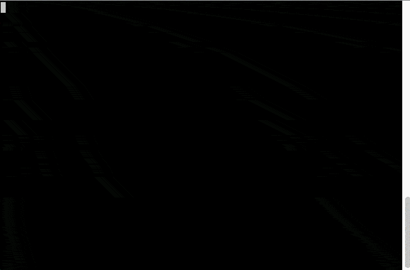

Test at:
https://github.com/CMProductions/backend-test

## Server Requirements (Laravel 5.6)
https://laravel.com/docs/5.6/installation
- PHP >= **7.1.3**
- OpenSSL PHP Extension
- PDO PHP Extension
- Mbstring PHP Extension
- Tokenizer PHP Extension
- XML PHP Extension
- Ctype PHP Extension
- JSON PHP Extension
- Composer

## Install
The test was done entirely on Laravel 5.6. Please check laravel install Docs and make sure all requirements apply to run the test at your server/docker. 

`git clone https://github.com/amstrad/backend-test backend-test`

Move into the new folder:
`cd backendtest/laravelparser`

Install Deps:  

`composer install`

`npm install`

###Execute  script

Move into "laravelparser" folder and run:

**`php artisan import`**

or with params

**`php artisan import glorf`**

####Tweaking

Import files can be added or removed in the array $sources at ImportFeed Controller
 
    
    private $sources = array (
        'flub'      => 'yaml',
        'glorf'     => 'json',
       //filename   =>  type
    );

For the test, files are placed at "backend-test/laravelparser/storage/public/feed-exports"

###Unit Testing:

A simple function to check if import files are reachable/exist can be launched with

`./vendor/bin/phpunit` in project root

 

##### Files to watch:

- backend-test/laravelparser/app/Console/Commands/ParseFeed.php <-  Artisan Import task
- backend-test/laravelparser/app/Http/Controllers/ImportFeed.php <- Controller logic
- /Users/diego/sites/backend-test/laravelparser/tests/Unit/FeedTest.php <- Unit testing logic here

